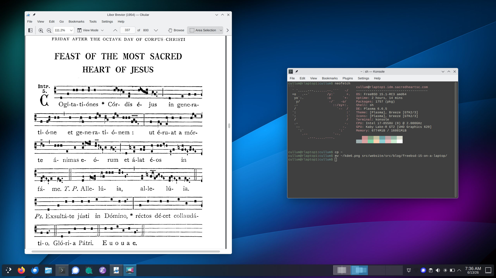

FreeBSD 15 really feels like a breakthrough release.

It's always been my favorite operating system for servers, but with the arrival of
[pkgbase](https://wiki.freebsd.org/action/show/pkgbase), massive improvements to the
[LinuxKPI](https://wiki.freebsd.org/LinuxKPI) drivers, and the launch of the [Laptop
Support and Usability Project](https://github.com/FreeBSDFoundation/proj-laptop), it's
become my primary desktop, too.

Since [my last attempt](/blog/freebsd-14-on-the-desktop/) with FreeBSD 14, a lot has
changed:

- KDE Plasma 6 was ported
- Wayland is now working
- Intel WiFi gained full support (not stuck on 802.11g!)

[](kde6.png){.center}

I'm getting about 6-7 hours of battery life with my ThinkPad X1 Carbon.
Other than Bluetooth (which I have not attempted), everything on my device
functions well with FreeBSD.

There's also a new [Laptop Compatibility
Matrix](https://freebsdfoundation.github.io/freebsd-laptop-testing/) where you can see
what works on your own hardware.

So let's build a FreeBSD laptop system with KDE!

This guide assumes you're using Intel graphics with an Intel wireless chipset.
I'm sure that other hardware configurations work fine, but I'm sticking with firsthand
experience here.


## Installation

Grab a [FreeBSD 15.1 memstick
image](https://download.freebsd.org/releases/amd64/amd64/ISO-IMAGES/15.1/FreeBSD-15.1-RELEASE-amd64-memstick.img)
and `dd` it to a USB stick:

```bash
curl -OJ https://download.freebsd.org/releases/amd64/amd64/ISO-IMAGES/15.1/FreeBSD-15.1-RELEASE-amd64-memstick.img
sudo dd if=FreeBSD-15.1-RELEASE-amd64-memstick.img of=/dev/sdX bs=1M conv=sync
```

The installation wizard is straightforward. Make sure your system is configured for UEFI
boot, and select `ZFS (GPT)` for the disk layout.

When prompted for base system installation type, choose `Packages` to get the new
[pkgbase](https://wiki.freebsd.org/action/show/pkgbase) goodness.

You'll want to enable SSH in the installer. Better to copy paste into an SSH session than
to type everything manually into a virtual console!

Once you reboot, login as root using the password you specified during installation.

## Get the Latest Packages

The FreeBSD ports tree has two branches: `quarterly` and `latest`.

The `quarterly` branch is basically a snapshot of the ports tree, taken four
times per year. In between quarterly snapshots, third-party packages receive only critical
security patches.

The `latest` branch is a rolling release that receives major package updates as
soon as they become available.

Personally, I prefer to take updates as they come, rather than deal with
a big pile of breaking changes four times a year.

FreeBSD ships with the `quarterly` repository configured by default. If you'd like to switch to `latest`,
then create an override directory:

```bash
mkdir -p /usr/local/etc/pkg/repos
```

Then create the following file:

```perl
# /usr/local/etc/pkg/repos/FreeBSD.conf

FreeBSD-ports: {
  url: "pkg+https://pkg.FreeBSD.org/${ABI}/latest"
}

FreeBSD-ports-kmods: {
    url: "pkg+https://pkg.FreeBSD.org/${ABI}/kmods_latest_${VERSION_MINOR}",
}
```

Finally, update your system:

```bash
pkg update
pkg upgrade
```

## Hardware Devices, Drivers, and Tuning

First, we'll configure device drivers and make various tweaks to get optimum performance
and battery life out of a desktop system.

Many of these steps are not strictly necessary, but they work well for me. Use your own
judgment!

### Bootloader Tunables

First, open up `/boot/loader.conf` and consider adding the following:

```bash
# /boot/loader.conf

# Timeout at the bootloader prompt (seconds).
autoboot_delay="3"

# HaRdEniNg: 99% of users will never need
# destructive dtrace.
security.bsd.allow_destructive_dtrace="0"

# The defaults here are way too conservative
# for desktop stuff like web browsers.
kern.ipc.shmseg="1024"
kern.ipc.shmmni="1024"
kern.maxproc="100000"

# If your system supports Intel Speed Shift
# (check dmesg), then set this to 0. This will
# allow each core to set its own power state.
machdep.hwpstate_pkg_ctrl="0"

# Enable PCI power saving.
hw.pci.do_power_nodriver="3"

# Enable faster soreceive() implementation.
# Don't use this if you run a BIND DNS server.
net.inet.tcp.soreceive_stream="1"

# Increase network interface queue length.
net.isr.defaultqlimit="2048"
net.link.ifqmaxlen="2048"

# For laptops: increase ZFS transaction timeout
# to save on battery life.
vfs.zfs.txg.timeout="10"
```

### Kernel Modules

Enable querying CPU information and temperature:

```bash
sysrc -v kld_list+="cpuctl coretemp"
```
The H-TCP congestion control algorithm is designed to perform better over fast,
long-distance networks (like the Internet). You might consider using it:

```bash
sysrc -v kld_list+="cc_htcp"
```

If you're using a ThinkPad, you'll need this module to get all your buttons working:

```bash
sysrc -v kld_list+="acpi_ibm"
```

### Sysctl Tweaks

Next, open up `/etc/sysctl.conf` and consider setting some of the following sysctls.
You can view the description of a sysctl using `sysctl -d`.

```bash
# /etc/sysctl.conf

# ==================
# sEcuRitY HaRdeNinG
# ==================

# These settings are pretty common sense for
# the majority of people:
hw.kbd.keymap_restrict_change=4
kern.coredump=0
kern.elf32.aslr.pie_enable=1
kern.random.fortuna.minpoolsize=128
kern.randompid=1
net.inet.icmp.drop_redirect=1
net.inet.ip.process_options=0
net.inet.ip.random_id=1
net.inet.ip.redirect=0
net.inet.ip.rfc1122_strong_es=1
net.inet.tcp.always_keepalive=0
net.inet.tcp.drop_synfin=1
net.inet.tcp.icmp_may_rst=0
net.inet.tcp.syncookies=0
net.inet6.ip6.redirect=0
security.bsd.unprivileged_read_msgbuf=0

# Some guides will tell you use these.
# More trouble than they're worth, IMO!
#
#kern.elf32.allow_wx=0
#kern.elf64.allow_wx=0
#security.bsd.hardlink_check_gid=1
#security.bsd.hardlink_check_uid=1
#security.bsd.see_other_gids=0
#security.bsd.see_other_uids=0
#security.bsd.unprivileged_proc_debug=0


# ==========================
# Network Performance Tuning
# ==========================

# The default values for many of these sysctls
# are optimized for the TCP latencies of a LAN.
#
# The modifications below should give you
# better TCP performance over connections with
# a larger RTT (like the Internet), at the
# expense of higher memory utilization.
#
# Source: it came to me in a dream
kern.ipc.maxsockbuf=2097152
kern.ipc.soacceptqueue=1024
kern.ipc.somaxconn=1024
net.inet.tcp.abc_l_var=44
net.inet.tcp.cc.abe=1
net.inet.tcp.cc.algorithm=htcp
net.inet.tcp.cc.htcp.adaptive_backoff=1
net.inet.tcp.cc.htcp.rtt_scaling=1
net.inet.tcp.ecn.enable=1
net.inet.tcp.fast_finwait2_recycle=1
net.inet.tcp.fastopen.server_enable=1
net.inet.tcp.finwait2_timeout=5000
net.inet.tcp.initcwnd_segments=44
net.inet.tcp.keepcnt=2
net.inet.tcp.keepidle=62000
net.inet.tcp.keepinit=5000
net.inet.tcp.minmss=536
net.inet.tcp.msl=2500
net.inet.tcp.mssdflt=1448
net.inet.tcp.nolocaltimewait=1
net.inet.tcp.recvbuf_max=2097152
net.inet.tcp.recvspace=65536
net.inet.tcp.sendbuf_inc=65536
net.inet.tcp.sendbuf_max=2097152
net.inet.tcp.sendspace=65536
net.local.stream.recvspace=65536
net.local.stream.sendspace=65536


# =====================
# Desktop Optimizations
# =====================

# Prevent shared memory from being swapped
# to disk.
kern.ipc.shm_use_phys=1

# Increase scheduler preemption threshold for
# a snappier GUI experience.
kern.sched.preempt_thresh=224

# Allow unprivileged users to mount things.
vfs.usermount=1


# ===================
# Laptop Power Saving
# ===================

# Decrease audio responsiveness to save power.
hw.snd.latency=7
```

### WiFi

Poor WiFi support is mostly a thing of the past, thanks to [LinuxKPI](https://wiki.freebsd.org/LinuxKPI)
and the new [iwlwifi](https://wiki.freebsd.org/WiFi/Iwlwifi) driver.
Check the [list of supported cards](https://wiki.freebsd.org/WiFi/Iwlwifi/Chipsets) to
see if your wireless card is supported.

First, install the necessary firmware package for your wireless card:

```bash
fwget -v
```

To use the newer `iwlwifi` driver on an older card, you might need to block the old `iwm`
driver from loading:

```bash
# /boot/loader.conf

devmatch_blocklist="if_iwm"
```

802.11n and 802.11ac are disabled by default. You'll need another `loader.conf` tweak to unlock higher speeds:

```bash
# /boot/loader.conf

compat.linuxkpi.iwlwifi_11n_disable="0"
compat.linuxkpi.iwlwifi_disable_11ac="0"
```

You might also want to try power saving mode:

```bash
# /boot/loader.conf

compat.linuxkpi.iwlwifi_power_save="1"
```

Update `rc.conf` to create a `wlan0` device on boot:

```bash
sysrc -v wlans_iwlwifi0="wlan0" \
         create_args_wlan="wlanmode sta country US regdomain FCC" \
         ifconfig_wlan0="WPA DHCP powersave"
```

With those settings, [wpa_supplicant(8)](https://man.freebsd.org/cgi/man.cgi?wpa_supplicant)
will manage your WiFi networks. You can either edit
[wpa_supplicant.conf(5)](https://man.freebsd.org/cgi/man.cgi?wpa_supplicant.conf(5)) by hand, or use the graphical interface provided by
[networkmgr](https://github.com/ghostbsd/networkmgr):

```bash
pkg install networkmgr sudo
```

`networkmgr` requires superuser privileges. You can allow all members of the `operator`
group to run `networkmgr` without a password using `sudo`:

```bash
# /usr/local/etc/sudoers.d/networkmgr

%operator ALL=NOPASSWD: /usr/local/bin/networkmgr
```

Note: There is currently a [known issue](#wifi-broken-after-suspend) with suspend
and resume using the `iwlwifi` driver on 15.1-RELEASE. I have a workaround though!

### CPU Microcode

Install the latest CPU microcode:

```bash
pkg install cpu-microcode
```

Edit `loader.conf` to load the microcode on boot:

```bash
# /boot/loader.conf

cpu_microcode_load="YES"
cpu_microcode_name="/boot/firmware/intel-ucode.bin"
```

### CPU Power Saving

You can save a **lot** of battery (and heat) by enabling lower CPU C-states:

```bash
sysrc -v \
  performance_cx_lowest=Cmax \
  economy_cx_lowest=Cmax
```

With modern Intel processors, it is no longer necessary to run [powerd(8)](https://man.freebsd.org/cgi/man.cgi?powerd).

### Intel Graphics Driver

Install the Intel graphics driver and make sure it's loaded on boot:

```bash
pkg install drm-kmod
sysrc -v kld_list+="i915kms"
```

### Device Permissions via devfs

For desktop systems, you'll need a custom [devfs(8)](https://man.freebsd.org/cgi/man.cgi?devfs(8)) ruleset to allow unprivileged users to
control common hardware devices. Create [devfs.rules(5)](https://man.freebsd.org/cgi/man.cgi?devfs.rules) with the following:

```ini
# /etc/devfs.rules

[localrules=1000]
add path 'drm/*'       mode 0660 group video
add path 'video*'      mode 0660 group video
add path 'backlight/*' mode 0660 group operator
add path 'usb/*'       mode 0660 group operator
```

Make sure to set your default ruleset like so:

```bash
sysrc -v devfs_system_ruleset=localrules
```

Give `devfs` a kick to fix those permissions:

```bash
service devfs restart
```

### Linux Binary Compatibility

The [Linuxulator](https://wiki.freebsd.org/Linuxulator) allows you to run Linux binaries on FreeBSD:

```bash
sysrc -v linux_enable=YES
```

If you run Linux binaries, you will probably need to mount some Linux filesystems as well:

```bash
# /etc/fstab

devfs     /compat/linux/dev     devfs     rw,late 0 0
tmpfs     /compat/linux/dev/shm tmpfs     rw,late,size=1g,mode=1777 0 0
fdescfs   /compat/linux/dev/fd  fdescfs   rw,late,linrdlnk 0 0
linprocfs /compat/linux/proc    linprocfs rw,late 0 0
linsysfs  /compat/linux/sys     linsysfs  rw,late 0 0
```

### FUSE

If you ever want to mount filesystems like exFAT or NTFS, you'll need [fusefs(4)](https://man.freebsd.org/cgi/man.cgi?fusefs):

```bash
sysrc -v kld_list+="fusefs"
```

### Webcams

With any luck, your webcam will be supported by [webcamd(8)](https://man.freebsd.org/cgi/man.cgi?query=webcamd)
without any fuss:

```bash
pkg install \
  webcamd   \
  v4l-utils \
  v4l_compat
sysrc -v webcamd_enable=YES
```

### Printers

If you want to print on FreeBSD, you'll need [CUPS](https://docs.freebsd.org/en/articles/cups/):

```bash
pkg install cups cups-filters
sysrc -v cupsd_enable=YES
```

You'll want to give members of the `operator` group the ability to configure printers:

```bash
# /usr/local/etc/upcs/cups-files.conf

SystemGroup operator

AccessLog syslog
ErrorLog  syslog
PageLog   syslog
```

Now you can start the daemon:

```bash
service cupsd start
```

You can access the CUPS configuration GUI in your browser at [localhost:631](http://localhost:631).

### USB Power Saving

If you’re using a laptop, you’ll want to power down inactive USB devices to save battery life.

Add the following to `/etc/rc.local`:

```bash
# /etc/rc.local

usbconfig | awk -F: '{ print $1 }' | xargs -rtn1 -I% usbconfig -d % power_save
```

### ThinkPad Backlight Controls

I had to do a bit of work to get the backlight keys working on my ThinkPad.

First, make sure the [acpi_ibm(4)](https://man.freebsd.org/cgi/man.cgi?acpi_ibm) kernel module is loaded:

```bash
kldload acpi_ibm
```

Then, set the following sysctl to allow [devd(8)](https://man.freebsd.org/cgi/man.cgi?query=devd)
to handle events for the backlight buttons:

```bash
sysctl dev.acpi_ibm.0.handlerevents="0x10 0x11"
```

Make sure you add that to `/etc/sysctl.conf`.

Now we can receive the button events, but we'll need a [devd rule](https://man.freebsd.org/cgi/man.cgi?query=devd.conf)
to handle them. Create `/etc/devd/thinkpad-brightness.conf` with the following:

```python
# /etc/devd/thinkpad-brightness.conf

notify 20 {
  match "system"    "ACPI";
  match "subsystem" "IBM";
  match "notify"    "0x10";
  action            "/usr/local/libexec/thinkpad-brightness up";
};

notify 20 {
  match "system"    "ACPI";
  match "subsystem" "IBM";
  match "notify"    "0x11";
  action            "/usr/local/libexec/thinkpad-brightness down";
};
```

Finally, create the following script at `/usr/local/libexec/thinkpad-brightness`:

```bash
#!/bin/sh
#
# /usr/local/libexec/thinkpad-brightness

cur=$(/usr/bin/backlight -q)

case $1 in
  up)
      if [ "$cur" -ge 50 ]; then
        delta=10
      elif [ "$cur" -ge 10 ]; then
        delta=5
      else
        delta=2
      fi
      /usr/bin/backlight incr "$delta"
    ;;
  down)
      if [ "$cur" -le 10 ]; then
        delta=2
      elif [ "$cur" -le 50 ]; then
        delta=5
      else
        delta=10
      fi
      /usr/bin/backlight decr "$delta"
    ;;
esac
```

Don’t forget to make it executable and restart devd:

```bash
chmod 755 /usr/local/libexec/thinkpad-brightness
service devd restart
```

### Reboot

Now is a good time to reboot and make sure your changes haven't broken anything!

```bash
reboot
```

## Firewall

I try to run a firewall on all of my systems.
A basic configuration can block all incoming connections except for SSH.

Create `/etc/pf.conf`:

```bash
# /etc/pf.conf

# Replace this with the names of your network
# interfaces.
egress = "{ em0, wlan0 }"

# Allow inbound ssh.
allowed_tcp_ports = "{ ssh }"

# Allow RTP traffic for voice and video calls.
allowed_udp_ports = "{ 1024:65535 }"

set block-policy return
set skip on lo

scrub in on $egress all fragment reassemble
antispoof quick for $egress

block all
pass out quick on $egress inet
pass in quick on $egress inet proto icmp all icmp-type { echoreq, unreach }

pass in quick on $egress inet proto tcp to port $allowed_tcp_ports
pass in quick on $egress inet proto udp to port $allowed_udp_ports
```

Start the firewall on boot:

```bash
sysrc -v pf_enable=YES
service pf start
```

## Disable Periodic Scripts

Out of the box, FreeBSD includes a lot of [periodic(8)](https://man.freebsd.org/cgi/man.cgi?periodic)
scripts that churn through your hard disk, reach out to the Internet, and send emails. You can check
[periodic.conf(5)](https://man.freebsd.org/cgi/man.cgi?periodic.conf) for a full list.

Some of these jobs are useful, but for a typical desktop user, most of them can be safely disabled:

```bash
sysrc -v -f /etc/periodic.conf          \
  daily_backup_aliases_enable=NO        \
  daily_backup_gpart_enable=NO          \
  daily_backup_passwd_enable=NO         \
  daily_clean_disks_verbose=NO          \
  daily_clean_hoststat_enable=NO        \
  daily_clean_preserve_verbose=NO       \
  daily_clean_rwho_verbose=NO           \
  daily_clean_tmps_verbose=NO           \
  daily_show_info=NO                    \
  daily_show_success=NO                 \
  daily_status_disks_enable=NO          \
  daily_status_include_submit_mailq=NO  \
  daily_status_mail_rejects_enable=NO   \
  daily_status_mail_rejects_enable=NO   \
  daily_status_mailq_enable=NO          \
  daily_status_network_enable=NO        \
  daily_status_security_enable=NO       \
  daily_status_uptime_enable=NO         \
  daily_status_world_kernel=NO          \
  daily_status_zfs_zpool_list_enable=NO \
  daily_submit_queuerun=NO              \
  monthly_accounting_enable=NO          \
  monthly_show_info=NO                  \
  monthly_show_success=NO               \
  monthly_status_security_enable=NO     \
  security_show_info=NO                 \
  security_show_success=NO              \
  security_status_chkmounts_enable=NO   \
  security_status_chksetuid_enable=NO   \
  security_status_chkuid0_enable=NO     \
  security_status_ipf6denied_enable=NO  \
  security_status_ipfdenied_enable=NO   \
  security_status_ipfwdenied_enable=NO  \
  security_status_ipfwlimit_enable=NO   \
  security_status_kernelmsg_enable=NO   \
  security_status_logincheck_enable=NO  \
  security_status_loginfail_enable=NO   \
  security_status_neggrpperm_enable=NO  \
  security_status_passwdless_enable=NO  \
  security_status_pfdenied_enable=NO    \
  security_status_tcpwrap_enable=NO     \
  weekly_locate_enable=NO               \
  weekly_show_info=NO                   \
  weekly_show_success=NO                \
  weekly_status_security_enable=NO      \
  weekly_whatis_enable=NO
```

## Create a User Account

You'll need a local user account. Be sure to add yourself to the `operator`,
`video`, and `wheel` groups:

```bash
pw useradd                \
  -n gsarto               \
  -c 'Giuseppe M. Sarto'  \
  -s /bin/sh              \
  -M 700                  \
  -d /home/gsarto         \
  -G operator,video,wheel
```

The `wheel` group allows you to run commands as root using `sudo`,
but you'll have to install it first:

```bash
pkg install sudo
```

Update the `sudoers` file to empower the `wheel` group:

```python
# /usr/local/etc/sudoers

%wheel ALL=(ALL:ALL) ALL
```

## Set Locale

Environment variables for login shells are set in [login.conf(5)](https://man.freebsd.org/cgi/man.cgi?login.conf).
Modify this file to set your preferred locale:

```diff
--- /etc/login.conf
+++ /etc/login.conf
@@ -23,7 +23,9 @@
        :umtxp=unlimited:\
        :priority=0:\
        :ignoretime@:\
-       :umask=022:
+       :umask=022:\
+       :charset=UTF-8:\
+       :lang=en_US.UTF-8:
```

You'll need to rebuild the login database to apply this change:

```bash
cap_mkdb /etc/login.conf
```

For non-login shells, you can set the same variables in a `profile.d` script:

```bash
# /etc/profile.d/locale.sh

export LANG=en_US.UTF-8
export CHARSET=UTF-8
```

## Enable NTP

You'll need [ntpd(8)](https://man.freebsd.org/cgi/man.cgi?query=ntpd) to keep your system clock up to date.

Edit [ntp.conf](https://man.freebsd.org/cgi/man.cgi?query=ntp.conf)
with your preferred NTP servers:

```bash
# /etc/ntp.conf

tos minclock 3 maxclock 6

pool 0.freebsd.pool.ntp.org iburst
pool 1.freebsd.pool.ntp.org iburst
pool 2.freebsd.pool.ntp.org iburst

restrict default limited kod nomodify notrap noquery nopeer
restrict source  limited kod nomodify notrap noquery

restrict 127.0.0.1
restrict ::1

leapfile "/var/db/ntpd.leap-seconds.list"

```

## Set Your Timezone

In case you didn't do this during the installation, set your timezone:

```bash
ln -sfhv /usr/share/zoneinfo/America/New_York /etc/localtime
```

## Switch to openssh-portable

The `ssh` in FreeBSD's base system is heavily patched. I prefer to use the vanilla
`openssh-portable` from ports:

```bash
pkg install openssh-portable
```

If you run `sshd`, the configuration file now lives in `/usr/local/etc/ssh`:

```bash
# /usr/local/etc/ssh/sshd_config

PermitRootLogin prohibit-password

UsePAM yes
UseDNS no

Subsystem sftp /usr/local/libexec/sftp-server
```

You'll need to swap your `sshd` in `/etc/rc.conf` to run the new version:

```bash
sysrc -v sshd_enable=NO openssh_enable=YES
service sshd stop
service openssh start
```

The `ssh` command will continue using `/usr/bin/ssh` from the base system unless you
update your `$PATH`.

You can edit `login.conf` to make this change for all users:

```diff
--- /etc/login.conf
+++ /etc/login.conf
@@ -4,7 +4,7 @@
        :welcome=/var/run/motd:\
        :setenv=BLOCKSIZE=K:\
        :mail=/var/mail/$:\
-       :path=/sbin /bin /usr/sbin /usr/bin /usr/local/sbin /usr/local/bin ~/bin:\
+       :path=/sbin /bin /usr/local/sbin /usr/local/bin /usr/sbin /usr/bin ~/bin:\
        :nologin=/var/run/nologin:\
        :cputime=unlimited:\
        :datasize=unlimited:\
```

As before, rebuild the login database to apply this change:

```bash
cap_mkdb /etc/login.conf
```

## Better Termcap Database

The [termcap(5)](https://man.freebsd.org/cgi/man.cgi?query=termcap&sektion=5) database in FreeBSD is simpler than you might find on Linux.
In particular, I noticed that **bright colors** would not render on XTerm-like terminals.

You can fix this by installing `terminfo-db`:

```bash
pkg install terminfo-db
```

## Install Root Certificates

FreeBSD trusts only a subset of the standard certificate authorities out of the box.
You'll want to make sure Mozilla's full CA bundle is installed:

```bash
pkg install ca_root_nss
```
## Enable D-Bus

D-Bus is required for KDE and pretty much everything else these days:

```bash
sysrc -v dbus_enable=YES
service dbus start
```

## Configure Ly Display Manager

Typically you'd use a graphical display manager like [SDDM](https://github.com/sddm/sddm)
to launch your desktop sessions.

Unfortunately, at the time of this writing, none of those display managers are able to reliably
start a Wayland session on FreeBSD.

SDDM can almost do it, but there is a [bug](https://bugs.freebsd.org/bugzilla/show_bug.cgi?id=286592)
that causes various key combinations to exit your session.

The current wisdom is to use the console-based [Ly display manager](https://codeberg.org/fairyglade/ly) to
launch Wayland sessions:

```bash
pkg install ly
```

Ly doesn't run as a daemon. Instead, you'll need to update [/etc/ttys](https://man.freebsd.org/cgi/man.cgi?ttys)
to launch it on a virtual console after system boot:

```diff
--- /etc/ttys    2026-06-15 09:11:43.272063000 -0400
+++ /etc/ttys    2026-06-15 09:12:23.756283000 -0400
@@ -2,7 +2,7 @@
 #
 ttyv0   "/usr/libexec/getty Pc"         xterm   onifexists secure
 # Virtual terminals
-ttyv1   "/usr/libexec/getty Pc"         xterm   onifexists secure
+ttyv1   "/usr/libexec/getty Ly"         xterm   onifexists secure
 ttyv2   "/usr/libexec/getty Pc"         xterm   onifexists secure
 ttyv3   "/usr/libexec/getty Pc"         xterm   onifexists secure
 ttyv4   "/usr/libexec/getty Pc"         xterm   onifexists secure
```

Now we just need to update [gettytab(5)](https://man.freebsd.org/cgi/man.cgi?gettytab)
with an entry for Ly:

```diff
--- /etcgettytab    2026-06-15 09:31:56.348452000 -0400
+++ /etc/gettytab   2026-06-11 20:37:58.000000000 -0400
@@ -234,3 +234,8 @@
        :np:nc:sp#115200:
 3wire.230400|230400-3wire:\
        :np:nc:sp#230400:
+
+# Ly login manager
+Ly:\
+  :lo=/usr/local/bin/ly_wrapper:\
+  :al=root:
```

You should see the Ly login prompt after your next reboot. Or, just give `init`
a little kick:

```bash
kill -HUP 1
```

Ly has many options you can configure in `config.ini`. For example:

```ini
# /usr/local/etc/ly/config.ini

# Force the use of wayland sessions:
xinitrc = null
xsessions = null
shell = false
waylandsessions = /usr/local/share/wayland-sessions
```

## Install Fonts

Make sure to install all the standard fonts so websites render properly:

```bash
pkg install        \
  cantarell-fonts  \
  droid-fonts-ttf  \
  inconsolata-ttf  \
  noto-basic       \
  noto-emoji       \
  roboto-fonts-ttf \
  ubuntu-font      \
  webfonts
```

## Install KDE and Desktop Apps

Grab a cup of coffee while you install KDE and other must-have desktop stuff:

```bash
pkg install               \
  en-aspell               \
  en-hunspell             \
  freedesktop-sound-theme \
  kde                     \
  kdegraphics             \
  kdemultimedia           \
  kdeutils                \
  phonon-mpv              \
  pipewire                \
  plasma6-breeze-gtk      \
  pulseaudio              \
  wireplumber
```

You'll also want your favorite desktop apps. For example:

```bash
pkg install          \
  chromium           \
  digikam            \
  dino               \
  elisa              \
  emacs-wayland      \
  firefox            \
  fooyin             \
  git                \
  gnupg              \
  haruna             \
  kid3-kf6           \
  konversation       \
  libreoffice        \
  linux-widevine-cdm \
  mpv                \
  neofetch           \
  password-store     \
  ripgrep            \
  rsync              \
  signal-desktop     \
  stow               \
  thunderbird        \
  tmux               \
  wine
```

Some desktop functionality now depends on [pipewire](https://pipewire.org/).
For example, taskbar previews don't seem to work unless `pipewire` is running.

You can start it automatically with an autostart file:

```ini
# /usr/local/etc/xdg/autostart/pipewire.desktop

[Desktop Entry]
Comment=Pipewire wayland thing
Exec=/usr/local/bin/pipewire -v
Name=pipewire
StartupNotify=false
Terminal=false
Type=Application
X-KDE-AutostartScript=true
X-KDE-SubstituteUID=false
```

### Store SSH Passphrases in kwallet

If you want `kwallet` to store your SSH key passphrases, then you'll need
to export some environment variables:

```bash
# /etc/profile.d/kde.sh

if [ "$XDG_CURRENT_DESKTOP" = KDE ]; then
  export SSH_ASKPASS_REQUIRE=prefer
  export SSH_ASKPASS=/usr/local/bin/ksshaskpass
fi
```

## Hardware Video Acceleration

With the right packages installed, most Intel GPUs support hardware video acceleration.
This will give you much smoother video playback and better battery life!

```bash
pkg install                \
  libva-intel-media-driver \
  libva-utils              \
  libvdpau-va-gl           \
  vdpauinfo
```

For this to work, your user will need access to the GPU via the `drm` device,
so make sure you've added yourself to the `video` group.

Some applications may need additional configuration to take advantage of the
hardware offload.

### Chromium Browser

Chrome used to require a scary incantation of command line flags to get hardware
video decoding working on FreeBSD.

But at the time of this writing, it *just works*.

### MPV

The following `mpv.conf` gives me HD video playback with minimal CPU usage:

```ini
# /usr/local/etc/mpv/mpv.conf

hwdec=vaapi-copy
vo=gpu-next
vd-lavc-dr=yes
audio-channels=stereo
```

## Known Issues and Workarounds

This section describes the issues I encountered while getting everything
working. Your mileage may vary, depending on your hardware!

### Laptop suspends immediately after lid open

Once KDE is running, the desktop environment listens for ACPI lid events and should handle
suspend and resume for you out of the box.

Unfortunately, this functionality has a [very annoying bug](https://forums.freebsd.org/threads/freebsd-15-kde-laptop-immediately-suspends-again-after-resume.101870/)
on my ThinkPad, where after I would open the lid, the laptop would immediately suspend itself again!

As a workaround, I disabled the lid switch behavior in KDE's power settings and configured
suspend on lid close natively using `devd`. This has the added benefit of being able to
close the laptop lid when KDE isn't running.

First, write a small script to handle locking the screen and suspending the device:

```bash
#!/bin/sh
#
# /usr/local/libexec/kde-suspend

# This is a big ugly shell pipeline that does
# two things:
#
#   1. Find anyone currently logged into KDE.
#   2. Lock their screen.
/usr/local/bin/qdbus6 --literal --system \
  org.freedesktop.ConsoleKit \
  /org/freedesktop/ConsoleKit/Manager \
  org.freedesktop.ConsoleKit.Manager.GetSessions \
  | /usr/bin/sed 's/^.*\(Session[0-9]*\).*$/\1/' \
  | /usr/bin/xargs -rtn1 -I%  \
    /usr/local/bin/qdbus6 --system \
      org.freedesktop.ConsoleKit \
      /org/freedesktop/ConsoleKit/% \
      org.freedesktop.ConsoleKit.Session.Lock

# Sleep for a moment to make sure the lock
# screen comes up.
/bin/sleep 0.5

# Suspend the device to state S3.
/usr/sbin/acpiconf -s3
```

Make the script executable:

```bash
chmod +x /usr/local/libexec/kde-suspend
```

Now just write a `devd` rule to call your script on lid close:

```python
# /etc/devd/kde-suspend.conf

notify 10 {
  match "system"    "ACPI";
  match "subsystem" "Lid";
  match "notify"    "0x00";
  action "/usr/local/libexec/kde-suspend";
};
```

Restart `devd` to apply the change:

```bash
service devd restart
```

### Processes linger after logout

On FreeBSD, I've found that some processes keep running indefinitely
after logging out of a KDE session.

Chromium is especially annoying: it sometimes gets trapped in a crazy
state where it consumes 100% of a CPU core forever.

I imagine the KDE developers are mostly concerned with systemd-based Linux distributions,
where [systemd-logind](https://www.freedesktop.org/software/systemd/man/latest/systemd-logind.service.html)
ensures all processes associated with a user session are terminated
when a session is closed.

Luckily, KDE has the ability to run a cleanup script whenever anyone logs out.
Create the following directory:

```bash
mkdir -p /usr/local/etc/xdg/plasma-workspace/shutdown
```

Then create a cleanup script in there, like so:

```bash
#!/bin/sh
#
# /usr/local/etc/xdg/plasma-workspace/shutdown/cleanup.sh

# Various processes seem to hang around after
# logging out of KDE sessions.
#
# Clean them up here!

pkill                \
  baloo_file         \
  chrome             \
  dirmngr            \
  pipewire           \
  plasma_waitforname \
  signal-desktop     \
  wireplumber

# "agent" is too nondescript of a process name,
# so match on the full path
pkill -f /usr/local/libexec/geoclue-2.0/demos/agent
```

Don't forget to make it executable:

```bash
chmod +x /usr/local/etc/xdg/plasma-workspace/shutdown/cleanup.sh
```

### User switching doesn't work

Desktop user switching is broken on FreeBSD due to a longstanding
[ConsoleKit2 bug](bugs.freebsd.org/bugzilla/show_bug.cgi?id=221452).

To prevent users from even attempting it, you can disable KDE user
switching globally in the `kdeglobals` file:

```ini
# /usr/local/etc/xdg/kdeglobals

[KDE Action Restrictions]
action/start_new_session=false
action/switch_user=false
```

### WiFi broken after suspend

Unfortunately, there is an [iwlwifi bug](https://bugs.freebsd.org/bugzilla/show_bug.cgi?id=263632)
present in 15.1-RELEASE that results in broken WiFi after resuming from sleep.

Luckily, there is a simple workaround: disable the interface before suspend, and
enable it after resume. This can be done automatically with a custom
`rc.d` script:

```bash
#!/bin/sh
#
# /usr/local/etc/rc.d/iwlwifi_fix
#
# PROVIDE: iwlwifi_fix
# KEYWORD: suspend resume

. /etc/rc.subr

name="iwlwifi_fix"
extra_commands="suspend resume"
suspend_cmd="iwlwifi_fix_suspend"
resume_cmd="iwlwifi_fix_resume"

iwlwifi_fix_suspend(){
  /usr/sbin/service netif stop wlan0
}

iwlwifi_fix_resume(){
  /usr/sbin/service netif start wlan0
}

load_rc_config "$name"
run_rc_command "$1"
```

Make sure it's enabled:

```bash
chmod +x /usr/local/etc/rc.d/iwlwifi_fix
sysrc -v iwlwifi_fix_enable="YES"
```

A fix has already been [committed](https://cgit.freebsd.org/src/commit/?id=0c0f66541aa220af38261af6360713ded6e3f15d)
to 15-STABLE, so hopefully this workaround will be unnecessary once FreeBSD 15.2 is released.

### Audio freezes on laptops

There is an [i915 bug](https://bugs.freebsd.org/bugzilla/show_bug.cgi?id=229190)
on some laptops that results in hard lockups. The problem is accompanied by `dmesg` errors that
look like this:

```
hdac0: Command timeout 2
```

The solution is a simple loader tunable:

```bash
compat.linuxkpi.i915_disable_power_well=0
```

### Graphics freezes and GPU hangs

With FreeBSD 15.1, the default DRM driver was bumped from version 6.6 to version 6.12.

Unfortunately, the new version appears to have a [bug](https://bugs.freebsd.org/bugzilla/show_bug.cgi?id=295625)
on some Intel chips that causes graphical freezes accompanied by `GPU HANG` messages in `dmesg`.

A reliable workaround is to simply continue using the previous version:

```bash
pkg install drm-66-kmod
```

### No console idle timeout (DPMS)

A few years ago, FreeBSD switched from the old [syscons(4)](https://man.freebsd.org/cgi/man.cgi?syscons)
console driver to the new UEFI-native
[vt(4)](https://man.freebsd.org/cgi/man.cgi?vt) driver.

Unfortunately, [no one bothered](https://bugs.freebsd.org/bugzilla/show_bug.cgi?id=233356)
to add `blanktime` support to the `vt` console, so there's effectively no way
to blank the screen on FreeBSD unless you're running an X11 or Wayland session.

Because the Ly display manager runs on the TTY console, this means that when no one
is logged in, your screen stays on forever. This isn't much of an issue on single-user
laptops, but if you're building a multi-user workstation, you might burn the login
prompt into your LCD panel!

### GTK4 apps missing icons

The only GTK4 app I use is the [Dino IM](https://dino.im/) XMPP client.
I noticed that many icons failed to render, and the app didn't respect
my KDE font settings.

After way too much debugging, I discovered that disabling [portals](https://docs.flatpak.org/en/latest/desktop-integration.html#portals)
fixed the problem immediately:

```bash
export GDK_DEBUG=no-portals
```

I try my best to avoid GTK apps, so I'm happy with this hacky workaround.

### Skips during audio playback

Pulseaudio would occasionally give me crackling and skipping when playing audio files.

This was easily fixed by bumping up some default values in pulseaudio's `daemon.conf`:

```ini
default-fragments = 8
default-fragment-size-msec = 5
```
